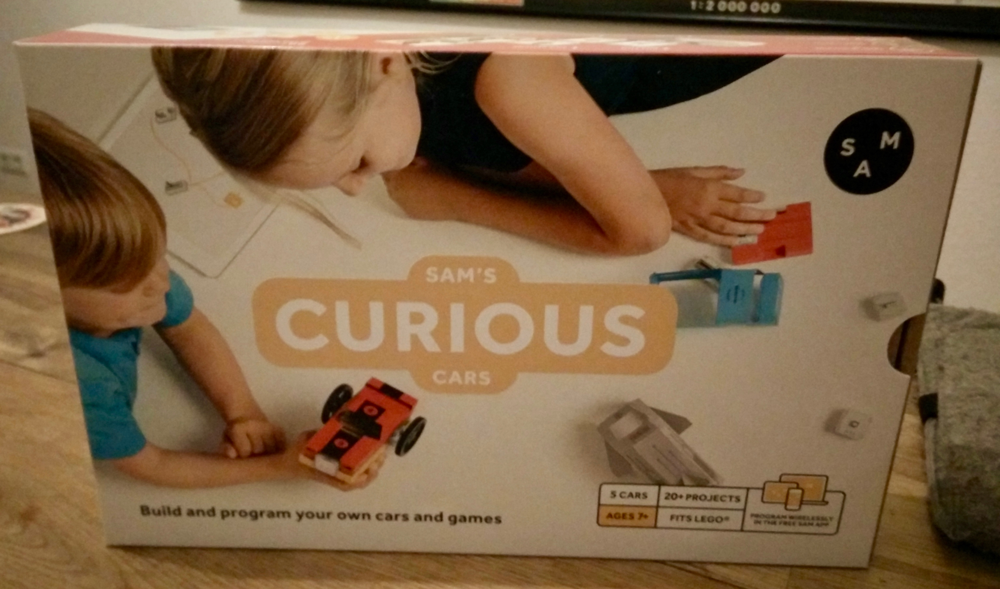
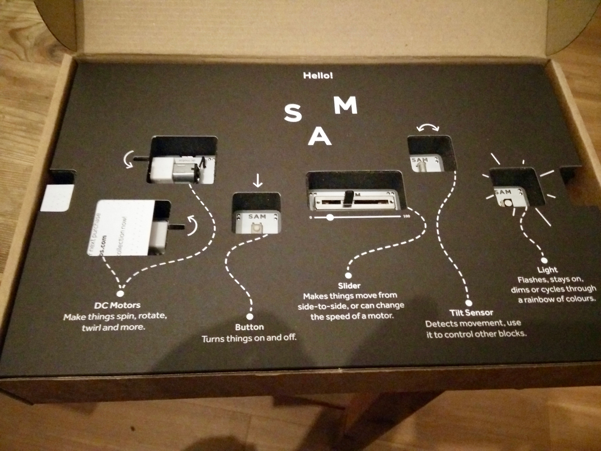
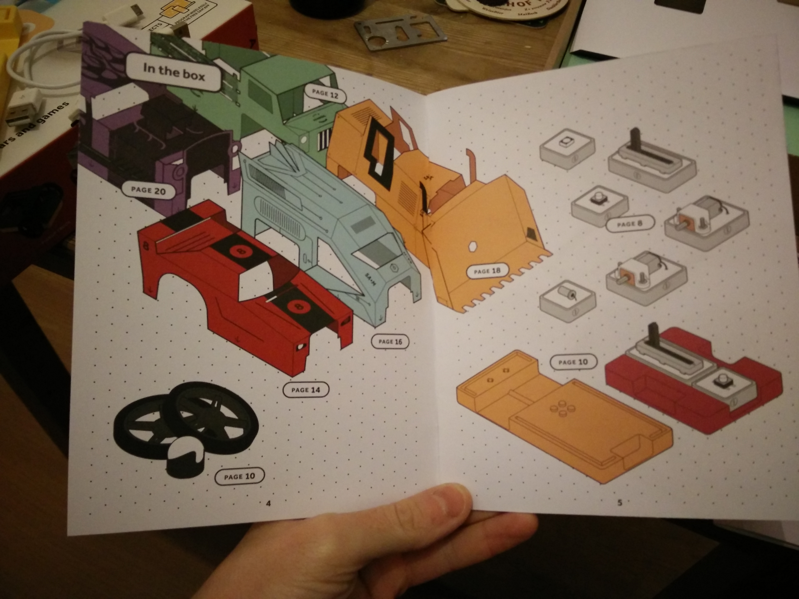
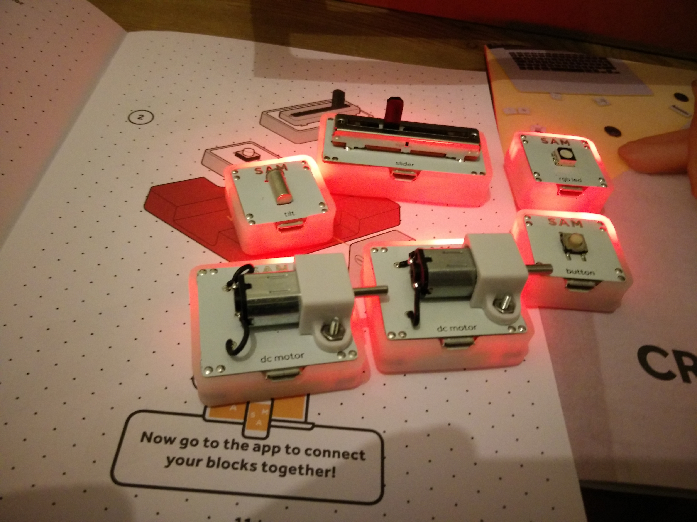
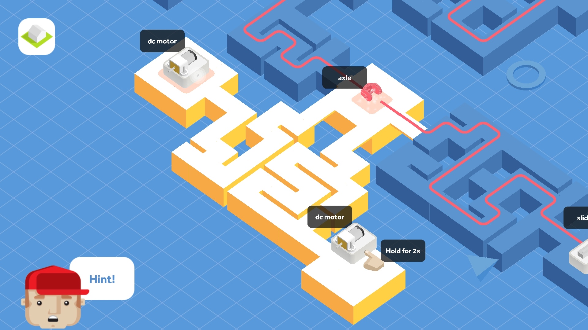

Last year at IFA I came across a small stall lurking within a gathering of startups. The booth was full of blinking small blocks, motors and switches that aimed to help children learn to code.

Fresh from my experiences and reflections teaching Syrian refugees to code, [I have been pondering the best ways to do so ever since](https://www.sitepoint.com/teaching-programming-whats-the-best-language-for-beginners/). In a series of posts that will cover a variety of projects, and a broader summary post, I intend to look at a variety of different techniques for teaching coding, especially to children.

Let's begin with the company I found myself in front of at IFA, [Sam labs](https://www.samlabs.com/), and their new product, curious cars.

## Unboxing

Unboxing curious cars is a delight in itself, inside a well designed box is an inlay that shows what component is what, and it's function. Pull out the foam inlay of components and you find a getting started guide.

But really the best starting point is with the curious cars mobile app (each kit has a different app). The app tells you which components to use and what to do with them, as you connect them together to create a variety of car-based projects.

The app instructs you to turn on components and connect them together (via bluetooth) by dragging your finger from one component to another. Then using the app, or by interacting with the components physically you can see how they respond to each other, for example pressing a switch rotates a motor.

After you've completed the first tutorial, you can move onto another, or explore what else is possible with the components.

If you have Lego blocks, you can attach them to sections of the car bodies. This wont affect the extensibility of the blocks, but imagine what else you could make creations look like aside from a car.

The kit costs £149, which puts it out of the price range of a casual toy into a more considered purchase. I'm not sure how this compares to similar 'toys' like more complex lego sets.

## A child's opinion

But what would I know, I am a 35 year old man. I am not Sam's intended audience. To get the opinion of the correct audience, I lent the kit for a week to a friend who had 8 and 11 year old children, in my mind a perfect age range.

He said that his children found the kit easy to understand and use but each child had a different approach to learning. One wanted to understand each step in detail before moving on, and the other wanted to complete everything quickly, and then understand it. This wasn't a problem itself, everyone's different, but a future idea for Sam labs might be to allow for different styles of learning. His second point was that neither of the children where sure what to do next after completing a couple of the cars. Sam labs offer further inspiration points on their website and a desktop application to create your own starting projects, but the connection points could be clearer.

## Does it teach programming?

I wouldn't say that curious cars (I'm uncertain about other Sam products) teaches programming per se, but it teaches concepts such as input/output, connecting logical blocks together, and creativity, so is a good starting point for parents who want to get their children coding in the future.
