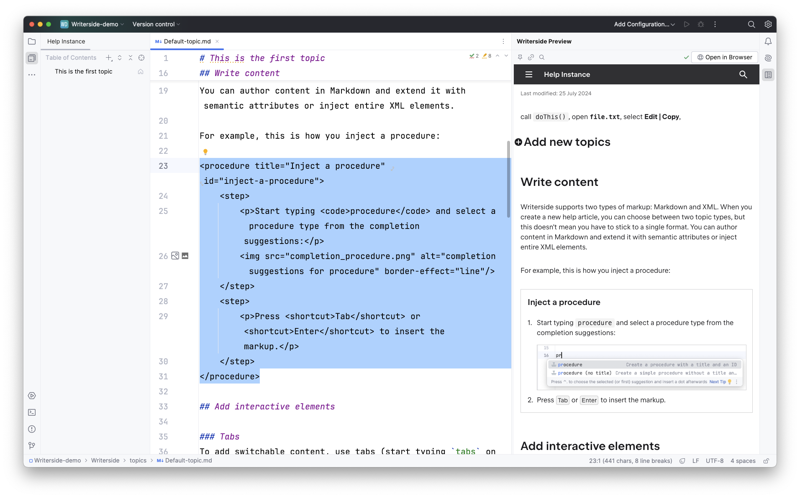
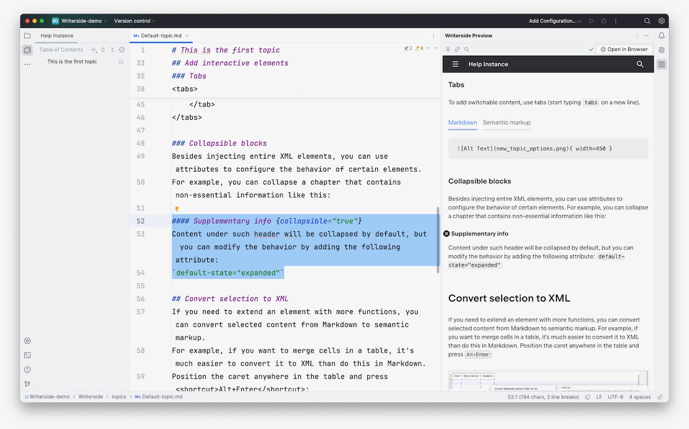
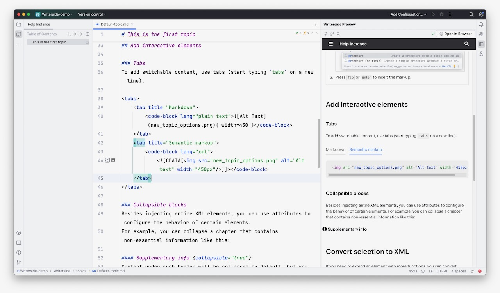
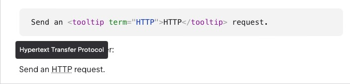
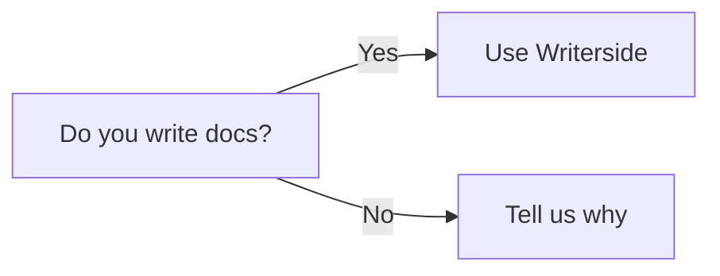

import { YouTube } from '@astro-community/astro-embed-youtube';

[JetBrains](https://www.jetbrains.com) is known for its variety of developer-focused IDEs, all based around its IntelliJ core. In recent years, they developed their own writer-focussed plugin, [Grazie](https://www.jetbrains.com/grazie/), for handling grammar and style guidance, [Writerside](https://www.jetbrains.com/writerside/) for a wide variety of tech writing tasks, and more recently, an AI assistant for writers. The company has also helped with community-maintained plugins such as those for [markdown](https://www.jetbrains.com/help/idea/markdown.html) and [asciidoc](https://plugins.jetbrains.com/plugin/7391-asciidoc). But then, a year or so ago, JetBrains announced that Writerside would become a fully-fledged tech writing IDE. I've been using it on and off for some time, and in this post, I take a look at some of its features, recent updates, and related plugins.

<YouTube id="YTWe7Nf4sfE" />
<YouTube id="5gh1TqMsYKE" />

## Plugin or IDE

One aspect of any Intellij-based IDES that I've always found a little confusing is that you can generally recreate any of the specialised IDEs by adding relevant plugins to IntelliJ. Personally, I kind of prefer the "tool for each purpose" approach, but this dual approach gives everyone the option they want to follow.

Writerside is no different, but I focus on the standalone IDE for the rest of this post.

## Markdown, XML, docs-as-code, and topic-based support

The technical writing world is split into a handful of different toolchains and opinions. One of those writes content with flavours of markdown in a more "loose" structure, and another uses XML-based markup for a stricter structure. Generally, those who use markdown (and some other similar markup languages) assemble and manage their documentation with a "docs-as-code" approach, i.e., treating documentation in similar ways to code. On the other hand, those who use XML-based formats tend to use a "topic-based" approach, treating separate concepts as individual "topics" that you then assemble into different outputs.

Interestingly, Writerside takes a hybrid approach. It lets you freely mix markdown and XML content with almost full compatibility of features, and it combines some aspects of "docs-as-code", such as version control, testing, and continuous processes, into a topic-based structure. This mixed approach offers flexibility but can be a little confusing if you're used to using one of the methodologies exclusively.

## Writerside is a complete toolchain

Because of the features mentioned in the last section, if you use Writerside to write, then you really have to use it to build the documentation to take advantage of its features. This does mean that if you already have a toolchain setup (probably in the docs-as-code ecosystem), then whilst you can still use Writerside to write, most of the useful features won't be useful to you for delivery.

That said, like every other writing tool and toolchain, it outputs to HTML, PDF, etc., so hosting the content it outputs is not a challenge.

## Custom markup suited to writers

Much like many other tools aimed at tech writers, Writerside packs a lot of custom markup syntax suited for tech writing needs. While the way you use syntax varies when you use markdown or XML, the functionality and output are the same. And being a fully-fledged ID, all the markup has autocomplete and snippets available.

In some cases, Writerside also lets you choose between generic markup, such as "bold text," or semantic markup, such as "a UI control." This is not the place to discuss the merits of semantic markup, but those of you who know what it's and why you should use it will find this useful.

I won't discuss every option available, but you've probably seen much of it before in other tools, such as tabs and admonitions. Instead, I'll feature some of the more interesting ones.

### Structural elements



Much like semantic markup in HTML, you can just declare everything as `div`s, `span`s, and `p`s, but that has no semantic context at all. Using content structure-specific markup like `chapter` and `procedure` with `steps` is better.

[The Markdown syntax doesn't always have a way of representing semantic markup, whereas it does in the XML markup](https://www.jetbrains.com/help/writerside/structural-elements.html).

Compare the XML:

```xml
<chapter title="Default chapter title" id="default-chapter-id">
	<title instance="foo">Chapter title for Foo</title>
	<p>Some text.</p>
</chapter>
```

This isn't great from a writing perspective, but it's consistent and understandable, and Writerside autocompletes the tags for you.

In Markdown:

```markdown
## Default chapter title {id="default-chapter-id"}

<title instance="foo">Chapter title for Foo</title>

Some text.
```

It's a bit mixed and inconsistent. This is one of the things you notice with Writerside. It supports Markdown, but either due to the nature of Markdown or because Writerside supports it with a little reluctance, using the custom syntax is sometimes not ideal.

### Semantic elements

In addition to overarching page structure elements, Writerside also provides inline elements to mark text as having a specific purpose, such as code, a UI element, or a path.

And in this case, the XML and Markdown markup is the same:

```xml
call <code>doThis()</code>, open <path>file.txt</path>, select <ui-path>Edit | Copy</ui-path>,
```

So, you already see that using Markdown is inconsistent and perhaps better seen as a way to bring existing content into Writerside.

### Collapsible elements



You can show chapters, procedures, code blocks, and definition list items as "collapsible," meaning that you can toggle the content's display by clicking a small icon next to the header.

With XML markup, you add `collapsible="true"` and with Markdown, add `{collapsible="true"}` next to the header text. You can follow a similar pattern with other parameters. there isn't a comprehensive list of all of these in the Writerside documentation. Some are scattered throughout [the markup reference](https://www.jetbrains.com/help/writerside/semantic-markup-reference.html), and others you find as you write markup in the editor.

### Tabs



Code and content tabs are one of my favourite formatting elements to add to documentation as they let you group related content together but let the reader select and toggle what parts of that related content they want to read.

[It's the same markup for XML and Markdown](https://www.jetbrains.com/help/writerside/tabs.htmlhttps://www.jetbrains.com/help/writerside/tabs.html). It's fairly clear and reminds me of how many markdown-based documentation tools also handle tabs:

```xml
<tabs>
	<tab id="windows-install" title="Windows"> How to install on Windows. </tab>
	<tab id="macos-install" title="macOS"> How to install on macOS. </tab>
	<tab id="linux-install" title="Linux"> How to install on Linux. </tab>
</tabs>
```

### Tooltips



In every documentation tool I use, I try to create a system for displaying glossary tooltips. Technical documentation is littered with jargon, providing readers with a quick way to hover over a term and see what it means they don't have to keep jumping back and forth between pages.

[For Writerside](https://www.jetbrains.com/help/writerside/tooltips.html), you first create a _glossary.xml_ file that defines the terms and descriptions, and then you can reference the term with the following markup:

```xml
Send an <tooltip term="HTTP">HTTP</tooltip> request.
```

### Admonitions

Finally, no technical writing tool is complete without a way to present "admonitions", pop-outs, or whatever you want to call them. I.e. areas of the page where you show a tip, note, warning, etc.

[Writerside has three admonition types defined](https://www.jetbrains.com/help/writerside/admonitions.html): tip, note, and warning. In XML markup, you use the type as the tag:

```xml
<warning>
	Use a warning for critical information about potentially harmful consequences, such as damage or data loss.
</warning>
```

For Markdown, you use quote syntax with the type added as a property if it's not a tip. I am not sure how you show a quote:

```markdown
> Use a note for important information that the reader should be aware of,
> like known issues or limitations.
{style="note"}
```

### Diagrams

Support for what I like to call "diagrams as code" is more widespread in documentation tools, and their markup languages are more common than they used to be. If the views of my video on Mermaid are anything to go by, it's a popular topic.

Writerside supports [Mermaid](https://www.jetbrains.com/help/writerside/mermaid-diagrams.html) and [PlantUML](https://www.jetbrains.com/help/writerside/plantuml-diagrams.html) by default and [D2](https://www.jetbrains.com/help/writerside/d2-diagrams.html) if you install it as a dependency. In every case, you add the diagram syntax in a code block. For XML that's the following:

```xml
<code-block lang="mermaid">
	graph LR
		A[Do you write docs?]
		A -- Yes --> B[Use Writerside]
		A -- No --> C[Tell us why]
</code-block>
```

And for Markdown:

```markdown

```

## Non-markup features

So far, so good. Writerside has comprehensive support for a lot of useful markup, but so do many other tools, and they don't require you to use a specialised tool. How else does it help you?

### API documentation

A handful of existing documentation tools support creating and rendering API specs, but often in a "bolted-on" way that does not allow you to link spec content with other content.

[You can either create XML or Markdown topics based on a spec](https://www.jetbrains.com/help/writerside/api-documentation.html) (requiring updating every time the specification changes) or embed an entire spec or part of it in a page.

```xml
<api-doc openapi-path="path/to/spec.yaml"/>
```

To specify a particular endpoint or operation, you first add the overall markup and then drill down:

```xml
<api-doc openapi-path="path/to/spec.yaml">
	<api-endpoint endpoint="/users" method="GET"/>
	<api-endpoint endpoint="/users" method="POST"/>
</api-doc>
```

You can even populate an endpoint with custom sample data that replaces what might be in the spec and can include other language output in addition to the default JSON output.

### Content reuse

One of the big selling points of topic and XML-based documentation tools is "write once" techniques, or "content reuse". Again, numerous Markdown-based tools offer their own form of this, as do technical writing-focused markup languages such as Asciidoc and RsT. However, tools like Writerside build this into the core purpose of the product and offer different options and methods for content inclusion and reuse.

[You can include parts of other content by adding an ID to an element](https://www.jetbrains.com/help/writerside/reuse-a-content-in-another-topic.html).

With the XML syntax:

```xml
<warning id="generic-warning">
	This version support ended on January 14, 2022. Download the latest version.
</warning>
```

And for Markdown:

```markdown
> This version support ended on January 14, 2022.
> Download the latest version.
>
{style="warning" id="generic-warning"}
```

And then include with the following syntax in either XML or Markdown synatx:

```xml
<include from="filename.EXT" element-id="generic-warning"/>
```

But while the syntax varies from tool to tool, content reuse is fairly common now, but Writerside adds more. [You can override the title](https://www.jetbrains.com/help/writerside/make-titles-differ.html) and other parts of included content items as well as [set variables and use basic logic](https://www.jetbrains.com/help/writerside/variables.html) to selectively show parts of included content. For example:

```xml
<warning instance="!sd">
	<p>This version of product support ended on January 14, 2022.</p>
	<p if instance="ac">Download the latest version <a href="link1">here</a>.</p>
	<a if instance="!ac">Download the latest version <a href="link2">here</a>.</p>
</warning>
```

Where `instance` is set in the snippet:

```xml
<snippet id="generic_warning">
	<warning>
		This version of %instance% support ended on January 14, 2021. Download the %latest% version.
	</warning>
</snippet>
```

You can use this logic in other ways too, wrapping entire sections. In XML:

```xml
<if instance="foo,bar">
	<p>This paragraph and the following image is filtered for instances `foo` and `bar`.</p>

	
</if>
```

And in markdown:

```markdown
<if instance="foo,bar">

This paragraph and the following image is filtered for instances `foo` and `bar`.


</if>
```

## Better writing

The final useful tool category is for improving your writing. I am interested in and involved in this topic and tool area, and Writerside bundles a handful of tools, including the one I contribute to, [Vale](https://vale.sh). In addition to these writing tools, it includes linters for structure and text, such as Markdown, AsciiDoc, HTML, etc.

The configuration for all of these is spread out across the settings and IDE interface, but they include:

- **Vale inspection**: Uses an unknown version of Vale's Regex-based language linting. You need to set up and configure Vale normally.
- **[LanguageTool](https://languagetool.org)**: A common language-checking tool that many tools integrate. It has a lot of small rules that you can't customise, but you can toggle.
  **Grazie** is [JetBrains' own language-checking tool](https://www.jetbrains.com/grazie/). Depending on which version you use, it has AI elements but also acts as an overview of some of the other tools. I won't cover Grazie in great detail here, as there's a lot to it, but I will cover it in a future post very soon.
- **[JetBrains AI](https://www.jetbrains.com/ai/)**: A new AI tool that does many of the assistive tasks we have now come to expect, and on the text-related front, this is a content generation, summaries, autocompletes, and more. Again, I am going to cover it separately in the same post as Grazie.

The different tools, their overlap, and how to configure them is slightly confusing, but it's nice to have these different types of tools available, integrated, and configurable.

## Building and publishing

OK, great, I've established that Writerside supports a lot of useful markup and features, but how can you deliver and publish the content?

Many topic-based tools support those who publish content to multiple output formats. While many of us typically only focus on delivering content to a website, others also need to deliver documentation to in-app help, PDFs, and print. This is where a lot of the content reuse, variables, and logic come into play. They allow a writer to render content in different formats selectively.

All that said, Writerside only supports [HTML](https://www.jetbrains.com/help/writerside/build-and-publish.html) and [PDF](https://www.jetbrains.com/help/writerside/export-to-pdf.html) output. There may be more to come, or Jetbrains might have decided that's all that most need these days.

Exporting to PDF gives a reasonable number of options for metadata and formatting, as does the HTML output, which you can preview as you work in the IDE.

## Summary

I have probably covered less than 50% of what Writerside packs into an IDE optimised for technical writers, but do I use it, or will I use it?

As always, it depends.

The main negative for me is that to use it, I have to switch an entire toolchain and any existing documentation. This isn't impossible, but it's likely a challenge to convince a company or team, especially as it also means that any other contributor needs to use Writerside. This is especially problematic if you run an open-source project; it means that any contributors also have to install a custom tool to contribute to anything beyond fixing small typos.

But if you or the teams around you are already using JetBrains tools and tooling and/or you have a greenfield project or opportunity to completely overhaul your current workflow with a closed-source tool, then, frankly, it's almost ideal.
