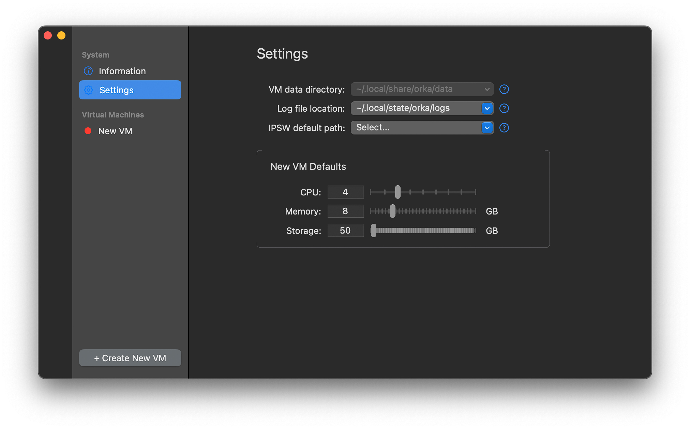
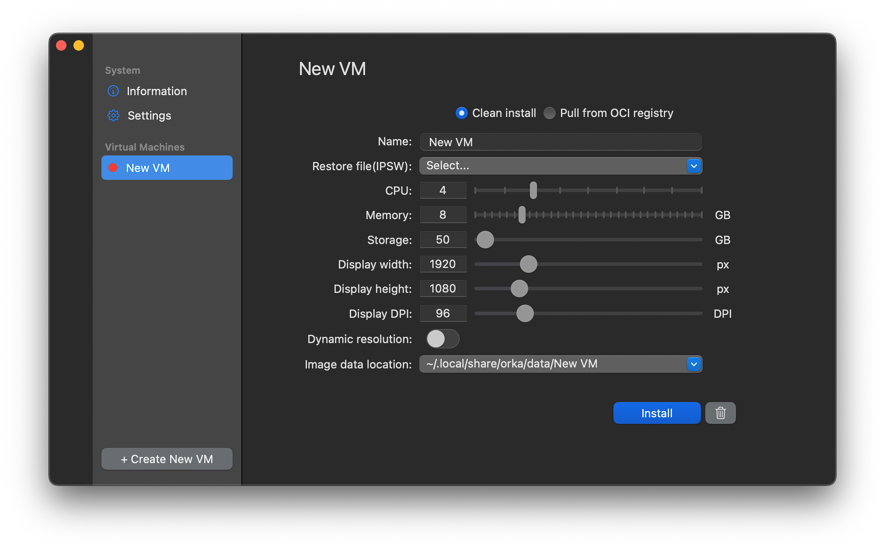
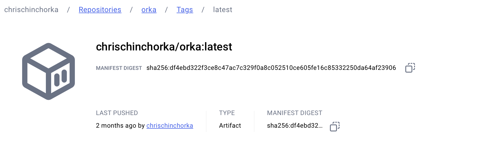

import { YouTube } from '@astro-community/astro-embed-youtube';

[Changes in recent versions of macOS](https://developer.apple.com/documentation/virtualization) have made running macOS and Linux virtual machines far easier and more performant. Primarily used for testing, a plethora of new applications that take advantage of these features emerged, so when Mac Stadium released a free desktop version of their long-running Okra range of virtualisation tools, one feature in particular stood out to me as something different and potentially useful.

In this article, I take a look at creating macOS virtual machines with [Orka Desktop](https://orkadocs.macstadium.com/docs/desktop-getting-started) and how to share them amongst your team and collaborators using its support for [open container initiative (OCI) compliant containers](https://opencontainers.org).

## Video version

<YouTube id="GKzN2ilMf3A" />

## Settings

You can set default VM resource settings, directory locations for logs, and where to pull [IPSW](https://en.wikipedia.org/wiki/IPSW) files from, which is the format used for Apple operating systems.

## Creating a VM

Settings get more interesting when creating a VM. Here, you can override the default resource settings and configure display settings. You can also select a local IPSW file to use or pull an image from an OCI repository. I'll come back to that later.

The biggest complication is that even a minimal macOS image is dozens of gigabytes, so if you need to download an image, it takes a while. When the image is downloaded, installing macOS takes a little time and involves jumping through a series of setup steps. Trust me, I have had to install Windows to VMs a couple of times recently, and setting up macOS is quick compared to Windows. At least MacOS doesn't repeatedly advertise other products and services to you.

Once installed and running, there are a limited number of extra features beyond the settings. No drag and drop between host and VM, no shared clipboard, etc. If you're looking for more features like that, [then read my full roundup of other virtualisation options](https://chrischinchilla.com/blog/2024/6-tools-running-windows-linux-macos).

## Sharing VMs

So far, so good. The plethora of other virtualisation tools all work similarly. Where things get more interesting is the ability to share images once you've customised them. There are ways to create and distribute images amongst fleets of macOS users by using 3rd party provisioning tools or [Apple's features](https://support.apple.com/guide/deployment/intro-to-mdm-profiles-depc0aadd3fe/web), but they aren't as common as with Windows. If you only want a beta version of macOS to test a new application release, they are probably overkill.

### Pushing an image

With Orka Desktop instead, once you've installed and customised a VM, you can then push it to an OCI-compliant registry, such as Docker Hub. Depending on the registry you use, figuring out the path and access details you need to set in Orka Desktop can take a little while, as they often expect you to be using the particular pre-authenticated tool to do it. And then, again, when you push, you have to wait.

Many OCI registries don't expect you to upload dozens of gigabytes. You may even find that some set limitations on certain account levels. The image that Orka Desktop pushes is also a somewhat impenetrable binary format for some of the registries. So, when I was looking on the image page on the Docker registry, it was hard to find what I uploaded.

### Pulling an image

Now, with a custom image pushed, your collaborators (or yourself in the future) can pull and run it. When creating a new VM, toggle the _Pull from OCI registry_ radio, fill in the authorisation details, and again… wait.

## Pre-existing images

Where there's the ability to create and share custom images, there's the potential to use trustworthy pre-existing images, and [Mac Stadium has a handful pre-configured and ready to go](https://github.com/macstadium/orka-images).

## Summary

And that's it! Beyond the OCI registry support, Orka Desktop is quite simple, but it is free, and for certain users who will find that feature useful, it's the only tool I know that offers it. If you are already using [MacStadium's more enterprise-focused tools](https://www.macstadium.com/orka-lp), then the OCI images you create fit right into the Orka Cluster tool and service for orchestrating macOS with Kubernetes. Coming from a cloud-native background, that sounds fascinating, and I hope one day to give it a try.
