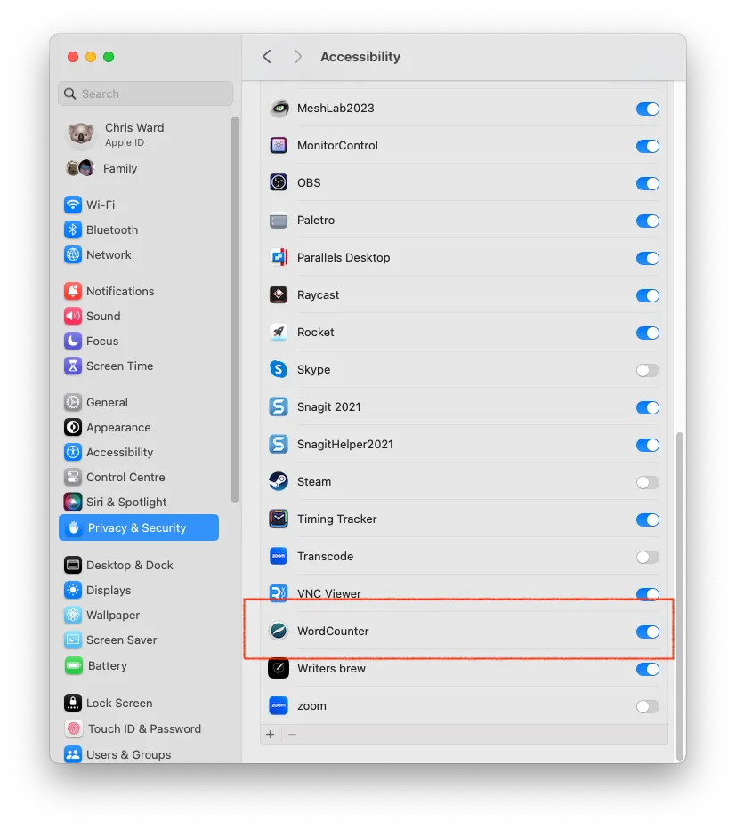
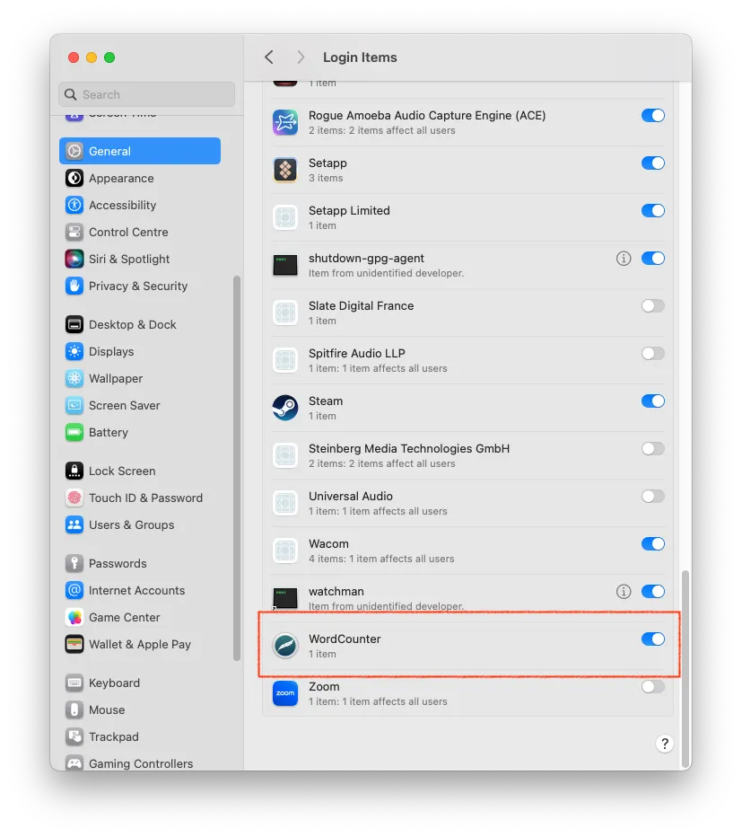
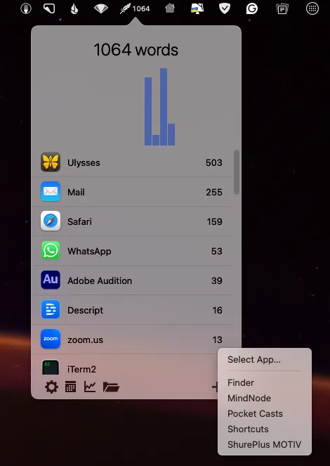
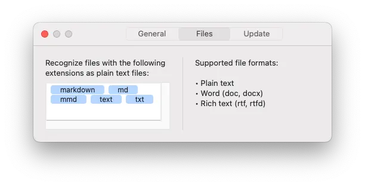

import { YouTube } from '@astro-community/astro-embed-youtube';

How many words do you write every day? Think about it. Every time you send an email, post in Slack, or comment on an Instagram post. Oh, you thought I would mention those wondrous words you pour into your latest novel, blog post, marketing copy, or script?

On a good day, those more creative works are where I'd like most of my words to end up, but in reality, it's probably the former category on average most of the time.

Over drinks with fellow writers last year, we started wondering how many words we wrote and where, and that might be an interesting programming experiment to create such a tool.

## Video version

<YouTube id="6KHr15xuV38" />

Then, I came across WordCounter quite by chance, which saved me the bother. As a technical experiment, I was still interested in how I might create my own. A short email conversation with WordCounter's developer quickly told me that creating system-wide textfield observers (on macOS, anyway) was challenging.
The Installation and setup of WordCounter simple, but you need to give the application accessibility permissions and let it run at login and in the background for maximum usefulness.

The main configuration step is to add all the applications you want to track. You do this by clicking the plus icon from the application menu bar. This isn't complicated, but can take a while, and it's easy to forget to add certain applications where you spend countless words.

For tracking words in actual editors, WordCounter, by default, tracks plain text, Word, and RTF, and you can also specify which file types you want to track as plain text, for example, Markdown, Asciidoc, etc.

## Is it useful?

"OK", I hear you saying, this is all very well and good, but show us the numbers! Where are your words ending up?
The data analysis tools in WordCounter are a little inconsistent. On a daily and even hourly basis, it sorts the word counts by application, but when you want to look over a time period, it doesn't sort the results. There's also a CSV export, but it only exports the word count by day, and that's it. I was more interested in the by-application value.

A screenshot showing 90 days of tracking history in WordCounterSo, with a bit of manual checking, my word count for the past 90 days was 135,000, and the top applications were:

- Safari: 25,845
- Scrivener: 20,953
- Slack: 14,179
- Mail: 13,359
- WhatsApp: 11,103
- Obsidian: 10,813
- VSCode: 6,953
- Discord: 5,891
- Word: 4,145

My average is about 1,500 words a day, with a high of 3,943 and a low of a few hundred, but this is mostly on weekends or holidays, so it isn't that useful.

For the past 90 days, I have been working on several projects in Scrivener, one of which I then have to review and submit using Word (unfortunately). When I work on technical documentation, I work almost exclusively in VSCode. Obsidian has become a note-taking dumping ground and a place where I often draft blog posts. So, most of those numbers make sense to me.

I am disappointed but not surprised to see such high numbers on WhatsApp, Slack, Discord, and Mail. However, it is hard to think what on earth I have been writing that outstrips my "real" writing. The one that surprises me the most is Safari. 25,000 words! I typically try to avoid doing too much work in the browser, but I guess I haven't succeeded.

A suggestion for an advanced feature in WordCounter could be to keep track of the actual words you type. That would be a weird and wonderful record to sift through later. Another might be to track word counts across matching applications on iOS, much like Timing does with time tracking.

## Does any of this help me?

It proves my unfortunate assumptions and shows that if I want to be more productive, I need to set up do not disturb and focus modes to better block certain applications when I am writing. But here we get into discussions on what "productivity" means. Despite their reputation, writing emails and Slack messages can be essential to productive work. While I use Discord for a mixture of uses, I can imagine that, for the most part, it's communication that could wait. WhatsApp, well, some groups and contacts are, of course, more important than others, but again, I think I could be more selective about when I use it.

WordCounter is in early but rapid development, so it will likely add new features soon. $20 is possibly a little high for a small utility application, but it's a one-off payment with a trial, not yet another subscription, so that's a big plus for me. All in all, WordCounter provides a fascinating insight into what you write and where. It's up to you how you act on those insights.
