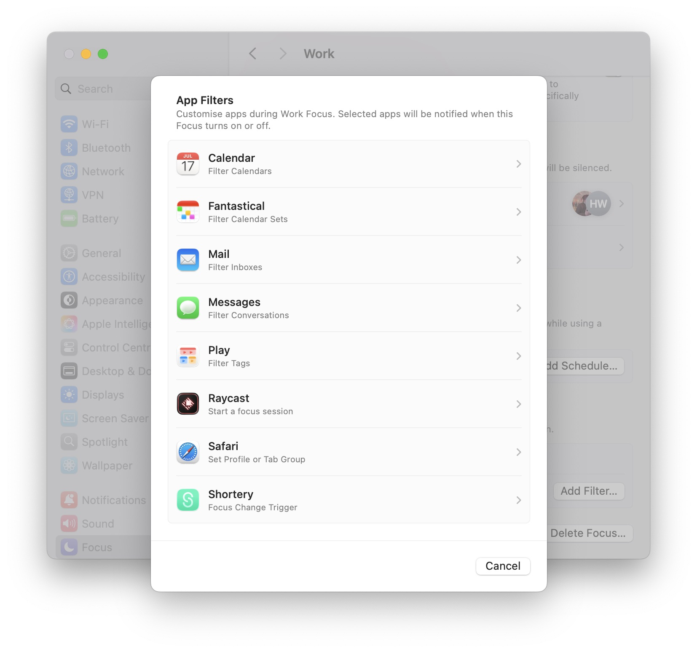
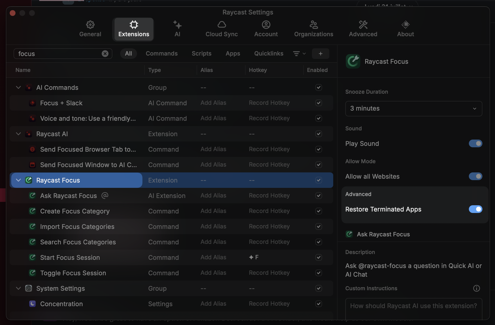
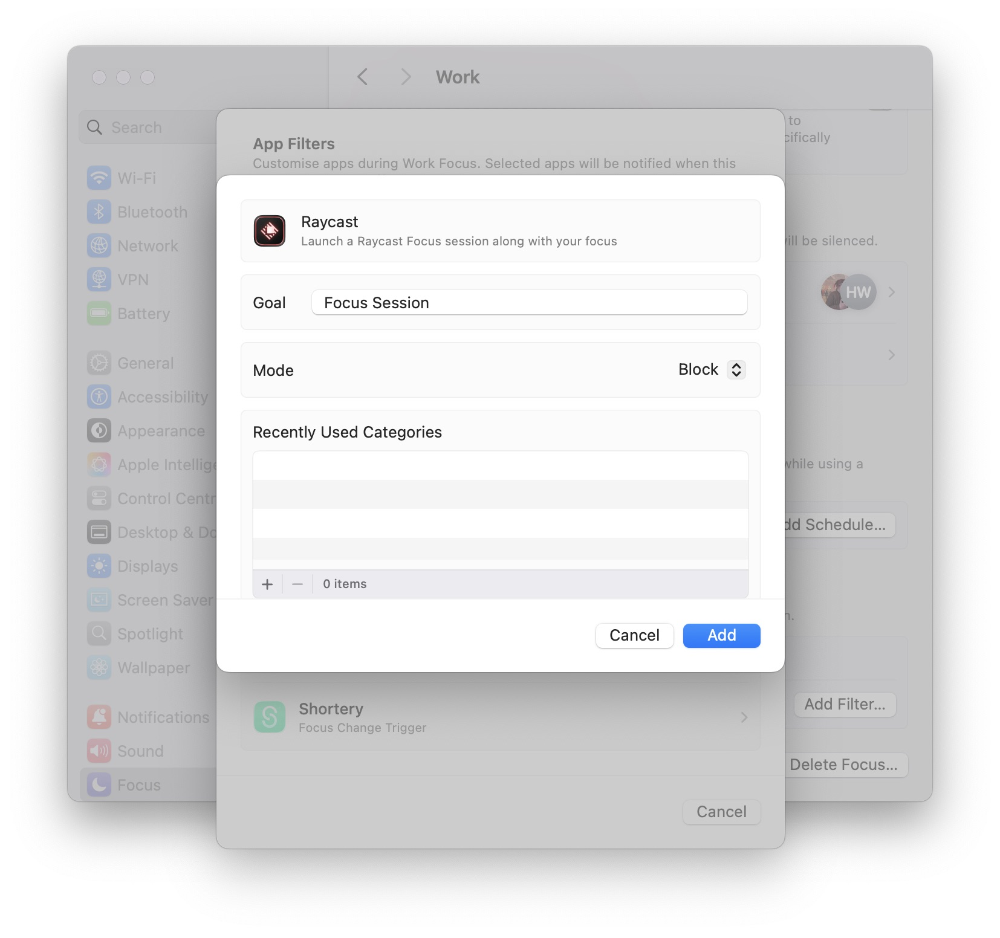
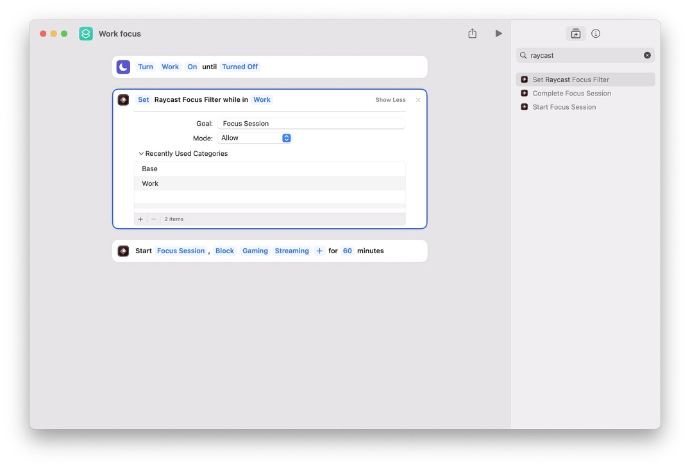
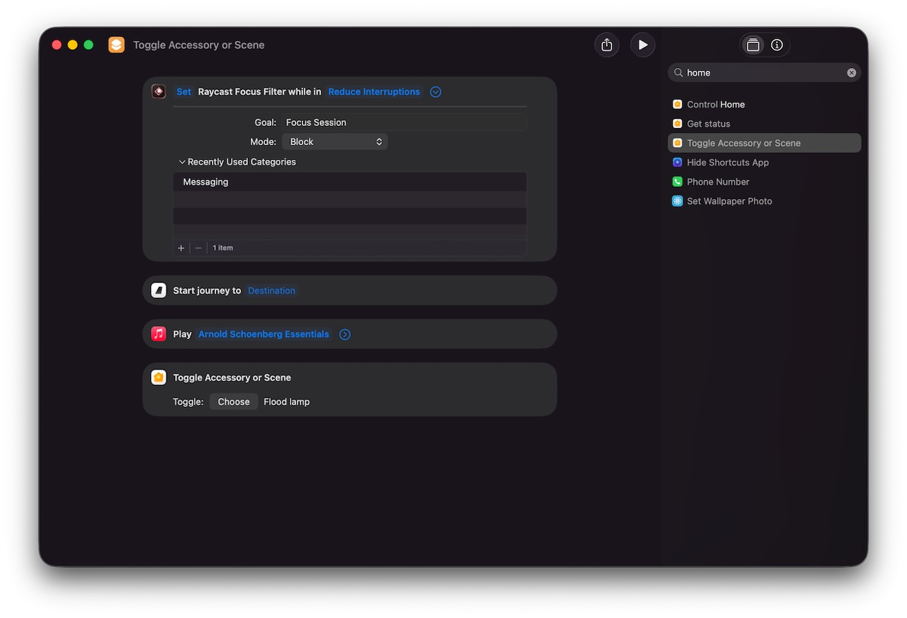

Surrounded by digital devices, it's all too easy to use any number of them to access a world of distractions, rather than focus on doing what you need to get done. In a strange, ironic twist, many of the devices and operating systems now offer tools to help block and filter these distractions. When I split myself between macOS and Android, I had focus modes set on both (conveniently, both OSs call them the same thing), but I never found them to be that effective, as I'd have to keep remembering to keep the equivalent modes the same on both devices. Then I bought an iPhone and discovered that the focus modes mostly sync between devices. With the arrival of the "Reduce Interruptions" focus mode in the 2024 operating systems, I went all in on optimising focus modes to work as efficiently as possible, not only blocking and filtering as many distractions as possible, but also automating them as much as possible.

One of the positives of keeping everything in Apple's ecosystem is the expectation of continuity (to use Apple's term) between devices. One of the negatives is that fewer developers than you hope integrate the necessary APIs and features to facilitate these continuity features, including Apple's Focus Modes APIs. This is especially true of cross-platform applications such as Discord and Slack, which will keep pinging away at you, no matter your focus mode settings. If developers do support focus modes, they are often limited to the options they offer, which typically include filtering and blocking notifications, but in some cases, filtering what you can see, such as mail accounts or calendar sets.

One of the biggest limitations is that the focus modes don't stop you from manually checking and distracting yourself. One day, I hope that Apple will enhance and consolidate focus modes with the downtime feature, which blocks application access but has its own limitations that focus modes could address.

Then I was digging around [Raycast](https//go.chrischinchilla.com/raycast) and noticed it had its own [focus feature](https://www.raycast.com/core-features/focus), which blocks applications and websites completely, and I wondered how I could combine the two for a truly focused and context-appropriate work experience.

## Set up

### Apple focus modes

You can find Focus mode configuration in _System Settings_. macOS should have "Do Not Disturb", "Reduce Interruptions", and "Sleep" by default. Apart from not being able to delete these modes, the process for creating and editing one is the same. Start by creating a new mode, which you do by clicking the _Add Focus…_ button.

The _Intelligent Breakthrough and Silencing_ section is an Apple intelligence feature that attempts to display notifications the OS considers important, regardless of your other settings.

I have found that in addition to the exceptions you set, this is generally when people directly "@" you in a chat app, messages relating to calendar events, 2FA requests, and a few other random things. It's not always accurate, and I run my computer in English, but I also receive a lot of notifications in German, so that might confuse the system.



The _Allow_ sections let you set the people and applications that can always send you notifications, no matter what. There are several caveats here:

- Even though the Focus modes sync between Apple platforms, sometimes the same application in each platform has a different package name (which is how the OS internally knows which application is which), so if you intend to sync Focus modes between platforms, you may need to add the "same" application on each OS.
- The People filter only works for contacts in your Contacts application. This is OK, but it also means that the filters only work with applications that use and respect contacts. For example, it filters messages from the Messages, Phone, and WhatsApp apps, but not from Discord or Slack.

I am a big fan of focus modes and use them all the time, but as I mentioned, they don’t go far enough. You can still open an application and distract yourself. This is where Raycast’s focus feature comes in.

### Raycast focus feature

If you don’t already know it, [Raycast](https://go.chrischinchilla.com/raycast) is a general-purpose productivity tool for macOS that combines elements of Spotlight with much more to create a highly customisable tool for running all sorts of tasks on macOS. Included in that ever-growing list of features is focus.

It takes on the more traditional role of other 3rd-party distraction-blocking apps, such as [Freedom](https://freedom.to), [SelfControl](https://selfcontrolapp.com), and [Cold Turkey](https://getcoldturkey.com). Some of these only block websites, while others block apps as well. If you’re already using Raycast, then it saves the need to install another application.

The feature works around “Focus sessions”, and these could be, for example, “coding” or “writing”. And then you start and stop a specific focus session.

As the main interface to Raycast is via the floating prompt bar, setting up what you want to block or allow is a little fiddly, especially as it’s easy to forget all the small utility or background applications you might need access to during a focus session, such as a music player, Apple Home, or your password manager. Adding all these apps and websites using the form interface can take a long time.

Thankfully, if you’re familiar with JSON (and if not, what you need to know for the focus feature is quite simple), [you can add all these in a series of JSON files](https://manual.raycast.com/focus/how-to-import-focus-categories) and import them as you update what you do and don’t need access to. When you start a focus session, you can select one or more categories so that you can create a series of domain adjacent categories, such as:

- Background utilities
- Writing apps
- Coding apps
- Messaging apps

Then, combine the categories as needed for the focus mode.

If you take the JSON file approach, you need to know the bundle ID of the application. This is generally hidden from users but identifies both the application name and the company name. Apple uses these to validate applications for malware and other security threats. You can find the value with the following command in a terminal:

```bash
osascript -e 'id of app "Application Name"'
```

Then, once you have populated the file, you can import it into RayCast with the "Import Focus Categories" command.

```json
[
  {
    "title": "Gambling",
    "websites": ["winamax.com", "stake.com"]
  },
  {
    "title": "French News",
    "apps": ["com.apple.news"],
    "websites": ["lefigaro.fr", "lemonde.fr", "liberation.fr", "lequipe.fr"]
  }
]
```

One final setting to note for the Raycast focus feature is that by default, when it blocks an application, it also quits them. This is helpful, but it can make it easy to forget what you had open before starting the focus session. You can enable relaunching the applications in the focus settings.



## Tying it together

So far, so good, but combining the macOS level and Raycast level focus features would be the real power move, and there are two ways to do this, each with caveats and possibilities: triggering Raycast focus modes from macOS focus modes or using Shortcuts.

### macOS Focus modes

Depending on the applications you use, you may never have looked into the filters you can add to a focus mode, as sadly, much like a lot of feature APIs, application developers don't always implement them.

Click the focus mode you want to edit, and then the _Raycast_ section. You can select the categories and whether to block or allow them.



### Shortcuts

Far more flexible is using Shortcuts, as you can trigger the focus session in more ways and also trigger more actions when you run it.

There are two ways to do this.

One is to use the "Start Focus Session" action. You can set whether to "Block" or "Allow", set the categories, and then set a time. Any of these fields could be from variables, meaning that you could prompt for the time, categories, and more, or set them via a calendar event, or myriad other ways.

The other is to use the "Set Raycast Focus Filter" action. Again, you can set most of the same fields, but the action is triggered by the specified focus mode being active. You can still pass some variables to the action, but fewer are available.


Both actions have their use cases, personally I prefer the "Set Raycast Focus Filter" action as it makes the macOS focus mode the, err, "focus" of things. But I do like the idea of using a calendar event to trigger the "Start Focus Session" action, passing the time, etc.

And then by using Shortcuts, you can manually trigger them with lots of other tools, for example, a Stream Deck, or Raycast itself.

Once you have Shortcuts running things, you can use it to trigger more actions related to your focus session. For example, apps like FocusFlight are currently popular, and several of them, FocusFlight included, support Shortcuts. In the example Shortcut below, when I enable the "Reduce interruptions" focus mode, it starts a journey in FocusFlight, starts a playlist and changes my lights. You could change the shortcut or create a paired one to toggle everything to a different state when the focus mode is disabled.



## Stay focussed

Helping people stay focused is a big industry, one which often monetises selling you "easy solutions" to what is often fundamentally a case of "getting on with it". While [Raycast](https://go.chrischinchilla.com/raycast) has a paid tier, nothing in this article is part of it, and I hope it has shown you how to combine it with features in your operating system to make a setup that hopefully works for you. Let me know what you try.
